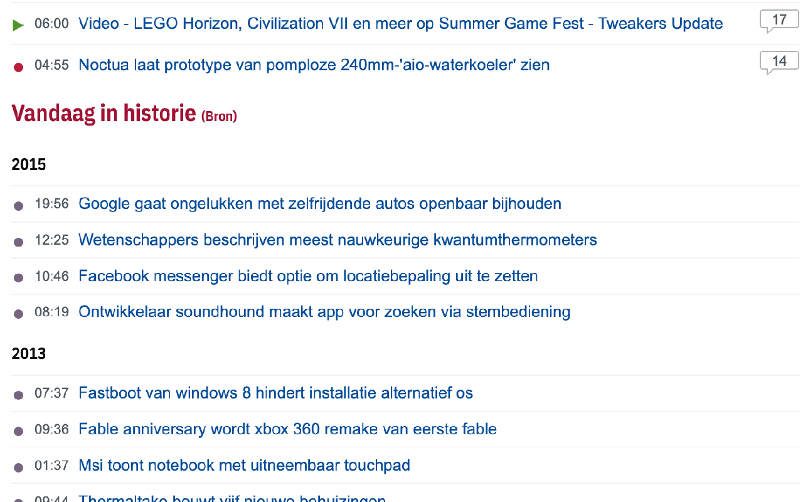
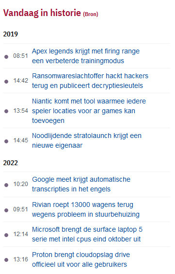
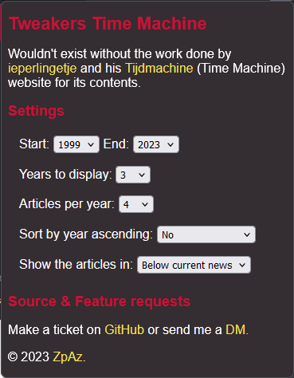

# Tweakers Time Machine

Chrome browser extension for the [Tweakers.net](https://tweakers.net) Dutch tech community website. Which adds an "On this day in..." section on the frontpage.
This section contains historical articles from the same day in other years.

Wouldn't exist without the work done by [ieperlingetje](https://tweaker.me/ieperlingetje) and his [Tijdmachine](https://randomize.be/wot_tijdmachine/) (Time Machine) website for its contents.

## Screenshot
### On website

### In sidebar

### Settings

## Installation

### Extension stores

&nbsp;&nbsp;

#### Chrome
- Navigate to chrome://extensions
- Expand the Developer dropdown menu and click “Load Unpacked Extension”
- Navigate to the local folder containing the extension’s code and click Ok
- Assuming there are no errors, the extension should load into your browser

#### Firefox
- Navigate to about:debugging#/runtime/this-firefox
- Click on Load Temporary Add on
- Navigate to the local folder containing the extension’s code and click Ok
- Go to Tweakers.net, click the extension icon and give access
- Assuming there are no errors, the extension should load into your browser

### Build your own
Build your own using [Build for distribution](#building-for-distribution)

## Building 
To build, a recent [node](https://nodejs.org/en) or equivalent needs to be installed.  

### Building for development
- `npm run build` generates a minified `content.js` file from the sources in the `./dist/` directory
- `npm run auto-build` runs the build command on file change

### Building for distribution
Run `npm run build-dist` which will pack the extension into a zip file with the current date and time in the root folder.

## Suggestions / Bugs
For any suggestions and or bugs please open a new [issue](https://github.com/matthijn/topic-tattle/issues) or send me a [DM](https://gathering.tweakers.net/forum/pm_new_message). PR's are welcome.  

## Contributors
- [ZpAz](https://tweaker.me/zpaz)
- [urk_forever](https://tweaker.me/urk_forever)

### Special thanks
- [ieperlingetje](https://tweaker.me/ieperlingetje)